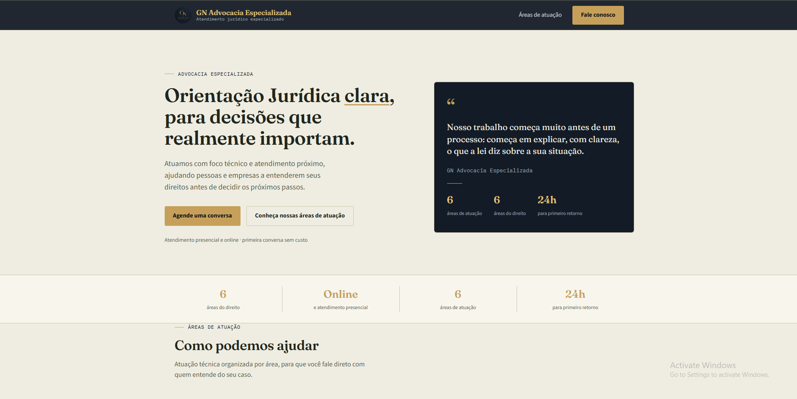

# ⚖️ GN Advocacia Especializada

> Site institucional desenvolvido para a GN Advocacia Especializada, com interface responsiva, back-end em PHP e integração com banco de dados.

---

## 📌 Sobre o projeto

O **GN Advocacia Especializada** é um projeto de desenvolvimento web criado para apresentar a presença digital de um escritório de advocacia.

O projeto foi desenvolvido com foco em uma interface **profissional, moderna, responsiva e intuitiva**, proporcionando uma experiência adequada em diferentes dispositivos.

A aplicação utiliza **HTML5, CSS3, PHP e MySQL**, integrando front-end, back-end e banco de dados.

Este projeto faz parte do meu **portfólio de desenvolvimento web**.

---

## ✨ Funcionalidades

- ⚖️ Apresentação do escritório
- 📋 Áreas de atuação
- 👨‍⚖️ Informações profissionais
- 📞 Informações de contato
- 🗄️ Integração com banco de dados
- 🔄 Processamento de informações com PHP
- 📱 Design responsivo
- 🎨 Interface moderna e organizada
- 🧭 Navegação intuitiva

---

## 🛠️ Tecnologias utilizadas

### Front-end

- HTML5
- CSS3

### Back-end

- PHP

### Banco de dados

- MySQL

---

## 📸 Demonstração

### 🏠 Página inicial

---

### ⚖️ Áreas de atuação

---

### 👨‍⚖️ Sobre o escritório

---

### 📞 Contato

---

## 🎯 Objetivo do projeto

O objetivo foi desenvolver uma solução web para um escritório de advocacia, aplicando conhecimentos de:

- Desenvolvimento Front-end
- Desenvolvimento Back-end
- PHP
- HTML5
- CSS3
- MySQL
- Responsividade
- Integração com banco de dados
- Organização de projetos web

---

## 💻 Desenvolvimento

Durante o desenvolvimento, foram trabalhados aspectos de **estruturação de páginas, estilização, responsividade, processamento de informações e integração com banco de dados**.

O projeto foi pensado para proporcionar uma experiência visual profissional, mantendo uma navegação simples e objetiva.

---

## 📱 Responsividade

A interface foi desenvolvida para diferentes tamanhos de tela:

- 💻 Desktop
- 💻 Notebook
- 📱 Smartphone
- 📟 Tablet

---

## 👨‍💻 Desenvolvedor

**SEU NOME**

Desenvolvedor Web

---

  ⚖️ <strong>GN Advocacia Especializada</strong>
    
  Projeto desenvolvido como parte do meu portfólio de desenvolvimento web.

