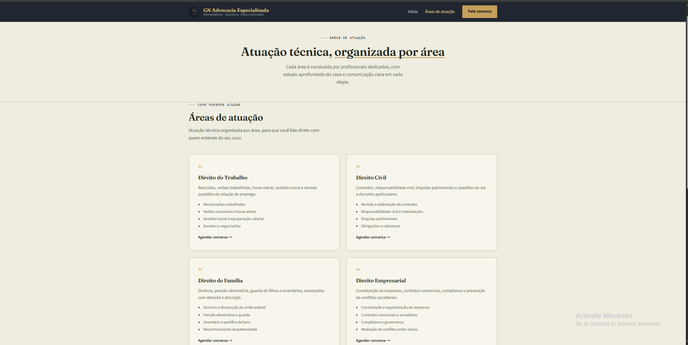
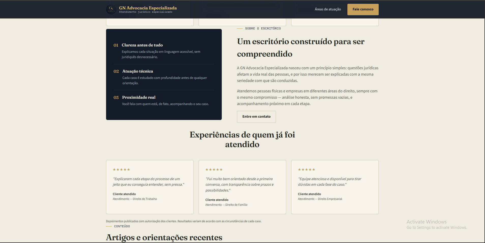
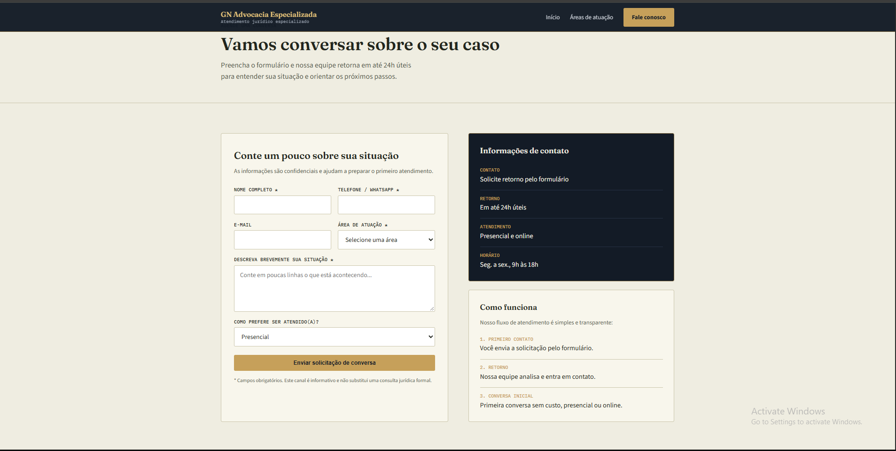
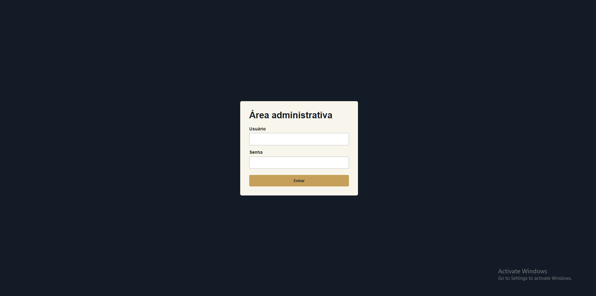

# ⚖️ GN Advocacia Especializada

> Site institucional desenvolvido para a GN Advocacia Especializada, com interface responsiva, back-end em PHP, integração com MySQL e funcionalidades voltadas ao atendimento e gerenciamento de processos.

---

## 📌 Sobre o projeto

O **GN Advocacia Especializada** é um projeto de desenvolvimento web criado para apresentar a presença digital de um escritório de advocacia e facilitar a comunicação com seus clientes.

O projeto foi desenvolvido com foco em uma interface **profissional, moderna, responsiva e intuitiva**, proporcionando uma experiência adequada em diferentes dispositivos.

Além da apresentação institucional, a aplicação possui funcionalidades como **agendamento de conversas, contato direto via WhatsApp e painel administrativo para acesso aos processos**.

A aplicação utiliza **HTML5, CSS3, PHP e MySQL**, integrando front-end, back-end e banco de dados.

Este projeto faz parte do meu **portfólio de desenvolvimento web**.

---

## ✨ Funcionalidades

### 🌐 Área pública

- ⚖️ Apresentação do escritório
- 📋 Áreas de atuação
- 👨‍⚖️ Informações profissionais
- 📞 Informações de contato
- 📅 Agendamento de conversa
- 💬 Contato direto via WhatsApp
- 📱 Design responsivo
- 🎨 Interface moderna e organizada
- 🧭 Navegação intuitiva

### 🔐 Área administrativa

- 🔑 Acesso ao painel administrativo
- 📂 Acesso aos processos
- 📋 Visualização das informações dos processos
- 🗄️ Integração com banco de dados

---

## 🛠️ Tecnologias utilizadas

### Front-end

- HTML5
- CSS3

### Back-end

- PHP

### Banco de dados

- MySQL

### Integrações

- WhatsApp
- Sistema de agendamento

---

## 📸 Demonstração

### 🏠 Página inicial

---

### ⚖️ Áreas de atuação

---

### 👨‍⚖️ Sobre o escritório

---

### 📅 Agendar conversa

---

### 🔐 Painel administrativo

---

### 📂 Processos

---

## 🎯 Objetivo do projeto

O objetivo foi desenvolver uma solução web completa para um escritório de advocacia, aplicando conhecimentos de:

- Desenvolvimento Front-end
- Desenvolvimento Back-end
- PHP
- HTML5
- CSS3
- MySQL
- Responsividade
- Integração com banco de dados
- Agendamento de atendimento
- Integração com WhatsApp
- Desenvolvimento de painel administrativo
- Gerenciamento e visualização de processos
- Organização de projetos web

---

## 💻 Desenvolvimento

Durante o desenvolvimento, foram trabalhados aspectos de **estruturação de páginas, estilização, responsividade, processamento de informações, integração com banco de dados e desenvolvimento de funcionalidades administrativas**.

O projeto foi pensado para proporcionar uma experiência visual profissional, mantendo uma navegação simples e objetiva para os usuários.

Também foi desenvolvida uma **área administrativa**, permitindo o acesso restrito às informações dos processos cadastrados no sistema.

---

## 📱 Responsividade

A interface foi desenvolvida para diferentes tamanhos de tela:

- 💻 Desktop
- 💻 Notebook
- 📱 Smartphone
- 📟 Tablet

---

## 👨‍💻 Desenvolvedor

**Igor Gonçalves Oliveira**

Desenvolvedor Web

---

  ⚖️ <strong>GN Advocacia Especializada</strong>
    
  Projeto desenvolvido como parte do meu portfólio de desenvolvimento web.

